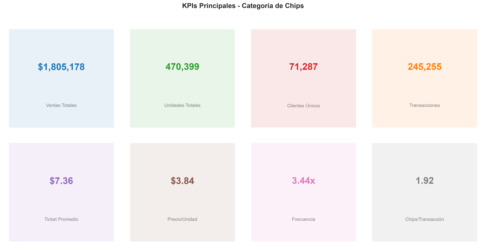
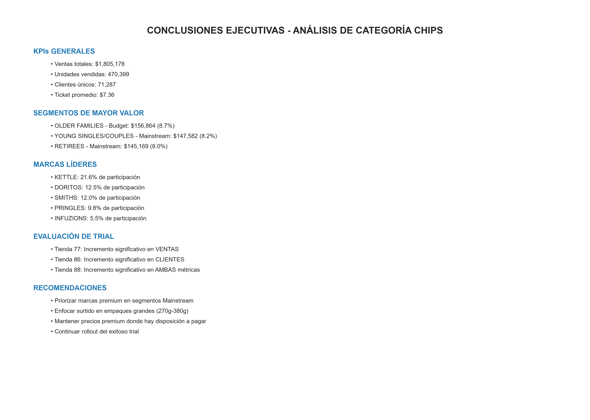
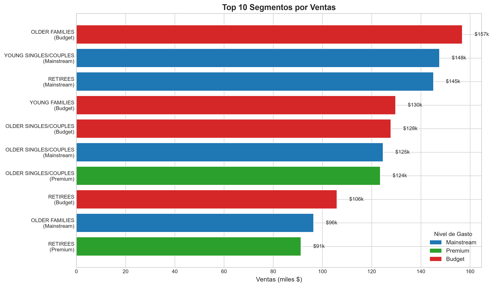
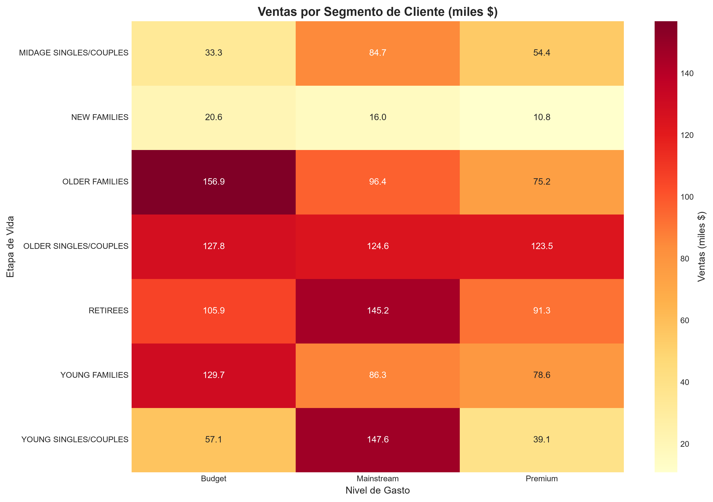
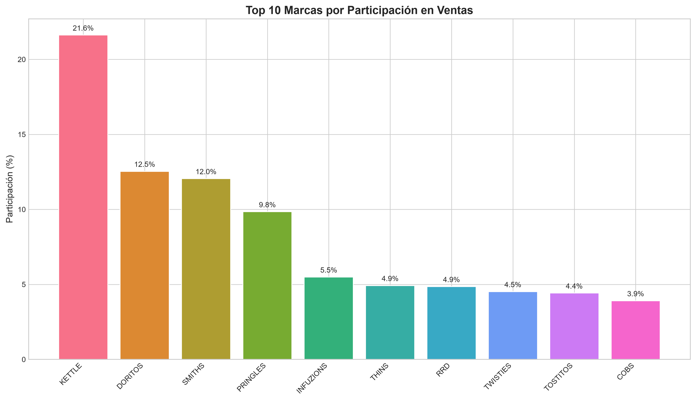
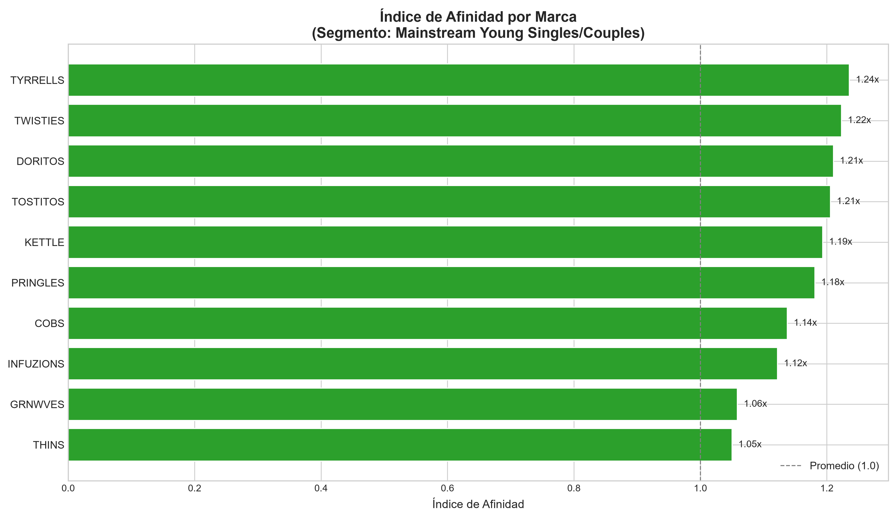
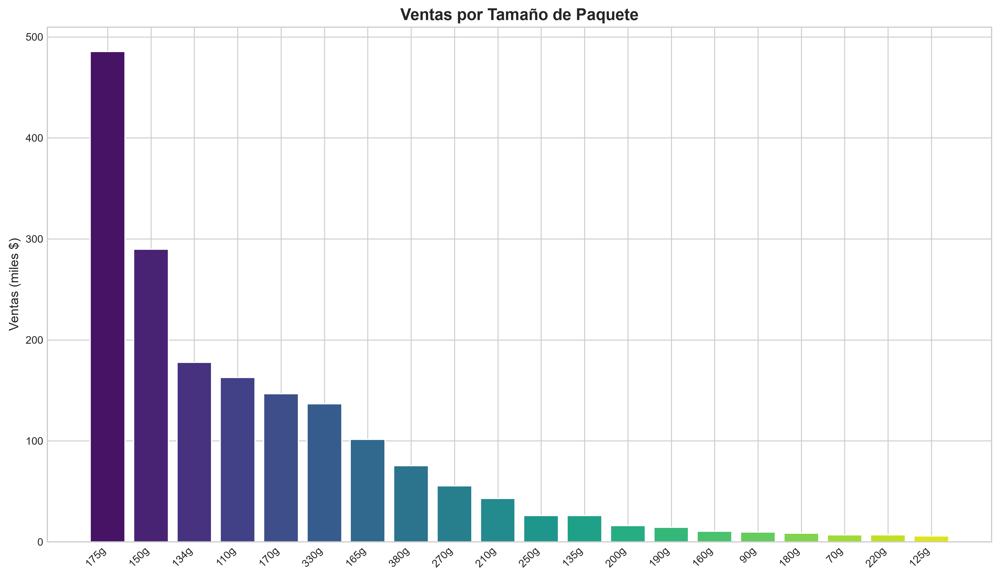
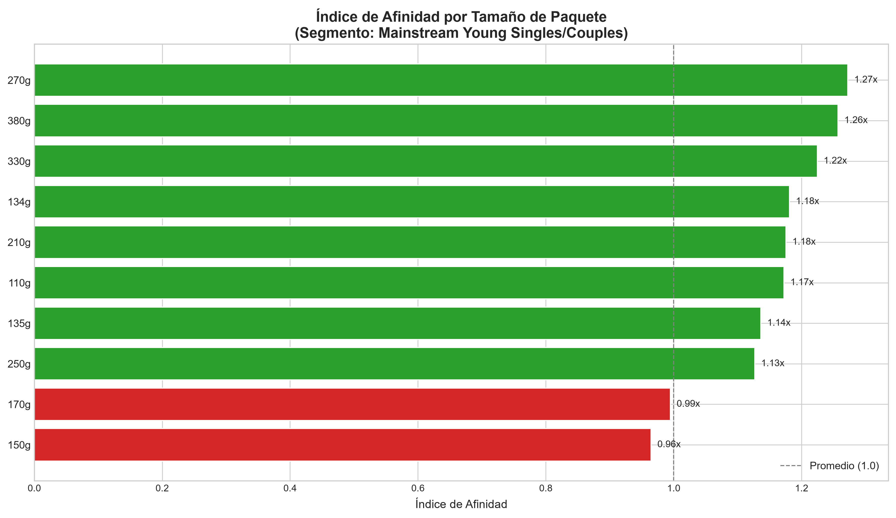
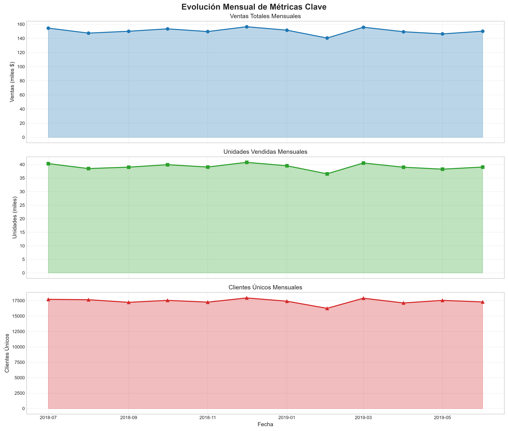
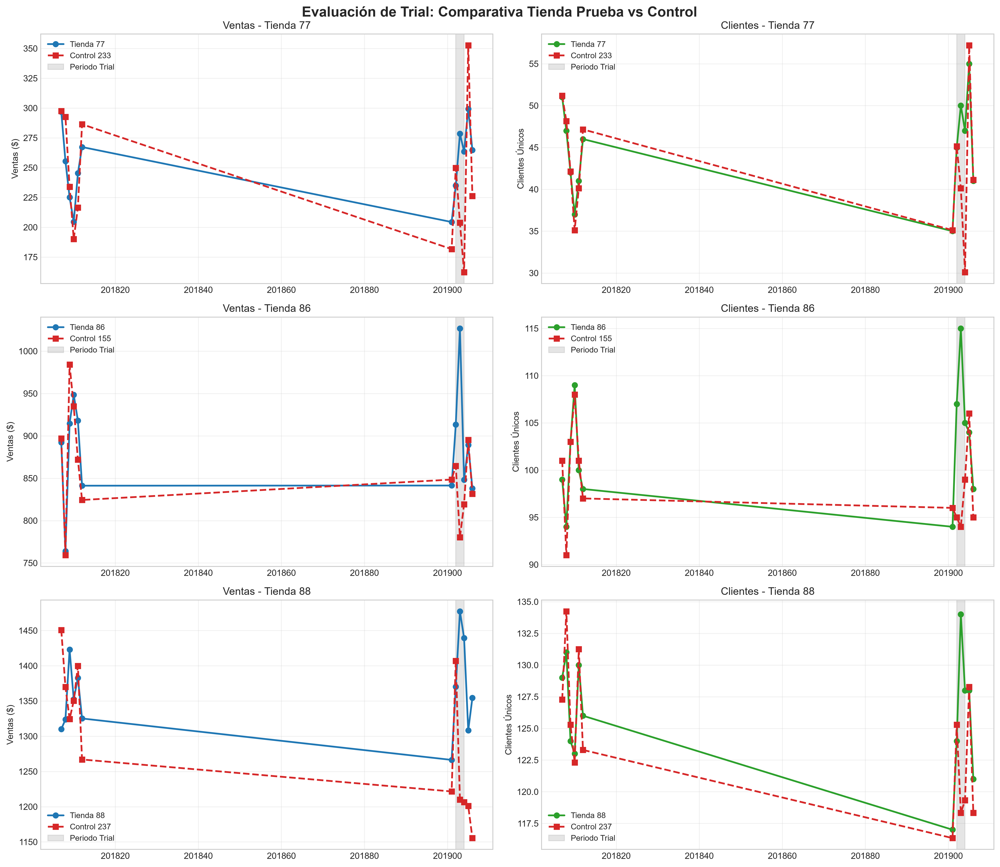

# Análisis de Categoría Chips - Quantium

Análisis de datos de transacciones y comportamiento de clientes para la categoría de **chips**, desarrollado como base de una recomendación estratégica para la revisión de categoría solicitada por la Gerencia Comercial.

## Contexto del proyecto

Este proyecto responde a una solicitud de análisis para respaldar con datos una recomendación estratégica sobre la categoría de chips. El objetivo es comprender las tendencias y comportamientos de compra actuales, identificando **quién compra chips**, **cuánto gasta** y **qué unidades consume** según distintos segmentos de clientes.

**Pregunta de negocio central:** ¿Qué segmentos de clientes impulsan las ventas de chips y cómo puede la categoría capitalizar ese comportamiento?

## Estructura del proyecto

```
├── data/
│   ├── raw/                        # Datos originales sin procesar
│   └── processed/                  # Datos limpios y enriquecidos
├── notebooks/
│   ├── analysis.R                  # (o .ipynb) Análisis exploratorio y de segmentación
│   └── quantium_insights_report.ipynb  # Genera las 10 visualizaciones PNG
├── scripts/
│   └── powerbi_export.py           # Genera los 7 CSV para Power BI
├── dashboard/
│   └── quantium_dashboard.py       # Dashboard interactivo (Plotly Dash)
├── outputs/
│   ├── csv_powerbi/                # CSV exportados para Power BI
│   │   ├── kpis_resumen.csv
│   │   ├── metricas_mensuales.csv
│   │   ├── ventas_por_segmento.csv
│   │   ├── afinidad_marcas.csv
│   │   ├── afinidad_paquetes.csv
│   │   ├── tendencia_mensual.csv
│   │   └── evaluacion_trial.csv
│   ├── visualizaciones/            # PNG generados por el notebook de insights
│   │   ├── kpi_summary.png
│   │   ├── heatmap_segmentos.png
│   │   ├── top_segmentos.png
│   │   ├── top_marcas.png
│   │   ├── afinidad_marcas.png
│   │   ├── distribucion_paquetes.png
│   │   ├── afinidad_paquetes.png
│   │   ├── tendencia_ventas.png
│   │   ├── trial_evaluation.png
│   │   └── conclusiones.png
│   └── findings_report.pdf         # Reporte de hallazgos iniciales
├── README.md
└── requirements.txt / DESCRIPTION
```

## Stack técnico

- **R** (dplyr, ggplot2, data.table) — análisis principal
- **Python** (pandas, matplotlib/seaborn) — análisis complementario
- **Plotly Dash** — dashboard interactivo para exploración de resultados
- **CSV** como formato de datos fuente

## 📊 Visualizaciones

10 gráficos generados con `notebooks/quantium_insights_report.ipynb`, disponibles en [`outputs/visualizaciones/`](./outputs/visualizaciones).

### KPIs y conclusiones ejecutivas

| KPI Summary | Conclusiones |
|---|---|
|  |  |

### Segmentos de clientes

| Top segmentos | Heatmap de segmentos |
|---|---|
|  |  |

### Marcas y paquetes

| Top marcas | Afinidad por marcas |
|---|---|
|  |  |

| Distribución de paquetes | Afinidad por paquetes |
|---|---|
|  |  |

### Tendencia y evaluación de trial

| Tendencia de ventas | Evaluación trial vs. control |
|---|---|
|  |  |

## 📈 Dashboard interactivo (Plotly Dash)

Además de las visualizaciones estáticas, el proyecto incluye un dashboard interactivo construido con **Plotly Dash** que permite explorar los resultados de forma dinámica: filtrar por segmento, marca y tamaño de paquete, y comparar métricas clave (gasto, unidades, frecuencia de compra) sin necesidad de regenerar gráficos manualmente.

**Funcionalidades principales:**
- Filtros interactivos por segmento de cliente, marca y tamaño de paquete.
- KPIs dinámicos que se actualizan según la selección.
- Gráficos de tendencia, distribución y afinidad equivalentes a los de `outputs/visualizaciones/`, pero explorables en tiempo real.

> Instrucciones de ejecución en el [Paso 4](#-cómo-ejecutar-el-proyecto) más abajo.

## 📑 Contenido del informe

| Componente | Métricas / Insights |
|---|---|
| **KPIs** | Ventas, unidades, clientes, ticket promedio, precio/unidad |
| **Segmentos** | 12 segmentos LIFESTAGE × PREMIUM, con ventas, clientes y frecuencia |
| **Marcas** | Top 10 marcas, market share, índice de afinidad |
| **Paquetes** | Distribución por tamaño, afinidad por segmento |
| **Tendencia** | Evolución mensual de ventas, unidades y clientes |
| **Trial** | Evaluación tiendas 77, 86, 88 vs. control (233, 155, 237) |

## 🏁 Conclusiones finales del proyecto

### Respuesta a la pregunta central

¿Qué segmentos de clientes impulsan las ventas de chips y cómo puede la categoría capitalizar ese comportamiento?

### 1. Segmentos que impulsan las ventas

| Segmento | Ventas ($) | Participación | Ticket promedio | Frecuencia |
|---|---|---|---|---|
| OLDER FAMILIES - Budget | $156,863.75 | 8.69% | $7.36 | 4.62 |
| YOUNG SINGLES/COUPLES - Mainstream | $147,582.20 | 8.18% | $7.58 | 2.46 |
| RETIREES - Mainstream | $145,168.95 | 8.04% | $7.30 | 3.13 |
| YOUNG FAMILIES - Budget | $129,717.95 | 7.19% | $7.36 | 4.46 |
| OLDER SINGLES/COUPLES - Budget | $127,833.60 | 7.08% | $7.49 | 3.52 |

Los 5 segmentos representan el **39.2%** del total de ventas (**$1.8M**).

### 2. Perfil del cliente típico

| Característica | Valor |
|---|---|
| Ticket promedio | $7.36 |
| Precio promedio por unidad | $3.84 |
| Unidades por transacción | 1.92 |
| Frecuencia promedio | 3.44 transacciones/cliente |

### 3. Marcas con mayor afinidad

| Marca | Índice de afinidad | Participación |
|---|---|---|
| TYRRELLS | 1.24 | 3.17% |
| TWISTIES | 1.22 | 4.60% |
| DORITOS | 1.21 | 12.17% |
| TOSTITOS | 1.21 | 4.55% |
| KETTLE | 1.19 | 19.67% |

> Un índice > 1 indica que el segmento objetivo (Mainstream Young Singles/Couples) compra más esta marca que el promedio.

### 4. Tamaños de paquete preferidos

| Tamaño | Índice de afinidad | Participación |
|---|---|---|
| 270g | 1.27 | 3.17% |
| 380g | 1.26 | 3.20% |
| 330g | 1.22 | 6.11% |
| 134g | 1.18 | 11.85% |
| 210g | 1.18 | 2.95% |

Los empaques grandes (270g-380g) tienen la mayor afinidad entre los clientes Mainstream Young Singles/Couples.

### Recomendaciones estratégicas

**Para el segmento Mainstream Young Singles/Couples (8.18% de ventas):**

1. **Surtido de productos**
   - Priorizar marcas premium: TYRRELLS, KETTLE, DORITOS.
   - Enfocar en empaques grandes (270g-380g).
   - Mantener precio premium (disposición a pagar: $4.07/unidad vs. $3.84 promedio).
2. **Promociones**
   - Descuentos por volumen en empaques grandes.
   - Promociones cruzadas con bebidas (complemento natural).
   - Programas de fidelización para aumentar frecuencia (actualmente 2.46 vs. 3.44 promedio).
3. **Ubicación en tienda**
   - Secciones de conveniencia y checkout.
   - Exhibidores cerca de bebidas y snacks.

**Para el segmento Familias (Budget/Premium) (25% de ventas combinado):**

1. **Surtido de productos**
   - Enfocar en marcas valor: SMITHS, PRINGLES, RRD.
   - Empaques familiares (330g-380g).
   - Precios competitivos.
2. **Promociones**
   - Descuentos por cantidad (compra familiar).
   - Packs combinados de variedades.
   - Cupones para próxima compra.
3. **Estrategia de fidelización**
   - Este segmento tiene la mayor frecuencia (4.4-4.7 transacciones).
   - Programas de recompensas por lealtad.

### Evaluación del trial

| Tienda | Tipo | Resultado |
|---|---|---|
| Tienda 77 (vs. Control 233) | Incremento significativo en VENTAS | Trial exitoso |
| Tienda 86 (vs. Control 155) | Incremento significativo en CLIENTES | Trial exitoso |
| Tienda 88 (vs. Control 237) | Incremento significativo en AMBAS métricas | Trial más exitoso |

**Recomendación:** continuar con el rollout de la estrategia de trial basada en los resultados positivos.

### Resumen ejecutivo

| Pregunta | Respuesta |
|---|---|
| ¿Quién compra chips? | Principalmente OLDER FAMILIES (Budget) y YOUNG SINGLES/COUPLES (Mainstream) |
| ¿Cuánto gastan? | $7.36 promedio por transacción, $3.84 por unidad |
| ¿Qué compran? | Marcas premium (TYRRELLS, KETTLE) en empaques grandes (270g-380g) |
| ¿Cómo capitalizar? | Enfocar surtido premium en Young Singles/Couples, valor en Familias, y expandir el trial exitoso |

### Impacto del proyecto

- **Datos procesados:** 246,741 transacciones, 71,287 clientes únicos.
- **Período analizado:** julio 2018 - junio 2019.
- **Ventas totales:** $1,805,177.70.
- **Outputs generados:** 7 CSV para Power BI, 10 visualizaciones PNG, 1 dashboard interactivo.

## 🚀 Cómo ejecutar el proyecto

```bash
# Clonar el repositorio
git clone https://github.com/giralrez/<nombre-del-repo>.git
cd <nombre-del-repo>

# Instalar dependencias
pip install -r requirements.txt
```

**Paso 1: Análisis exploratorio y de segmentación**

```bash
Rscript notebooks/analysis.R
```

**Paso 2: Exportar datos para Power BI**

```bash
python scripts/powerbi_export.py
```

Genera 7 CSV en `outputs/csv_powerbi/`:
- `kpis_resumen.csv` — KPIs globales
- `metricas_mensuales.csv` — Métricas por tienda/mes
- `ventas_por_segmento.csv` — LIFESTAGE × PREMIUM
- `afinidad_marcas.csv` — Índice de afinidad por marca
- `afinidad_paquetes.csv` — Índice de afinidad por tamaño
- `tendencia_mensual.csv` — Serie temporal
- `evaluacion_trial.csv` — Resultados estadísticos

**Paso 3: Generar visualizaciones PNG**

```bash
jupyter notebook notebooks/quantium_insights_report.ipynb
```

Ejecutar todas las celdas para generar 10 PNG en `outputs/visualizaciones/`:
- `kpi_summary.png` — Cards con KPIs
- `heatmap_segmentos.png` — Heatmap de ventas
- `top_segmentos.png` — Top 10 segmentos
- `top_marcas.png` — Market share
- `afinidad_marcas.png` — Índice de afinidad
- `distribucion_paquetes.png` — Ventas por tamaño
- `afinidad_paquetes.png` — Afinidad por tamaño
- `tendencia_ventas.png` — Evolución mensual
- `trial_evaluation.png` — Comparativa trial vs. control
- `conclusiones.png` — Tabla ejecutiva

**Paso 4: Dashboard interactivo**

```bash
python dashboard/quantium_dashboard.py
```

Acceder a [`http://127.0.0.1:8050`](http://127.0.0.1:8050).

## 👤 Autor

**Andrés Giraldo Ramírez**
Software Engineer | Data Analytics / ML / Data Engineering
GitHub: [@giralrez](https://github.com/giralrez)

---

*Este análisis forma parte de un ejercicio de estudio de caso del Quantium Virtual Internship - Retail Strategy and Analytics.*
